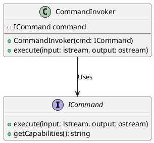
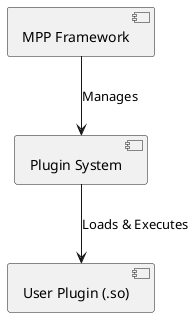
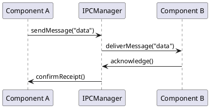

# Modular Packet Processor (MPP) - Design Document

- Modular Packet Processor (MPP) - Design Document
  - **1. Overview**
    - **1.1 Purpose**
    - **1.2 Key Features \& Ethos**
  - **2. Requirements \& Functional Specifications**
    - **2.1 Functional Requirements**
    - **2.2 Non-Functional Requirements**
  - **3. MPP-Core: Command Processing Model**
    - **3.1 Philosophy**
    - **3.2 Built-in Commands**
    - **3.3 Command Execution Model**
      - **3.3.1 User-Defined Commands**
      - **3.3.2 Command Interface (`ICommand`)**
      - **3.3.3 Command Invocation and Execution**
  - **4. Inter-Process Communication (IPC) in MPP**
    - **4.1 IPC Mechanisms**
      - **Supported IPC Mechanisms:**
  - **5. Plugin \& Module System**
    - **5.1 Dynamic Plugin Loading**
      - **Plugin Management Interface:**
    - **5.2 Plugin Execution Model**
  - **6. Command Query \& Validation System**
    - **6.1 `mpp --list-commands` (Command Discovery)**
      - **Implementation:**
      - **Test Considerations:**
  - **7. Test \& Verification Plan**
    - **7.1 Unit \& Integration Testing**
    - **7.2 Test Setup \& Execution**
  - **8. Development Priorities**
  - **9. UML Diagrams**
    - **9.1 Class Diagram for Command Execution**
    - **9.2 Component Diagram for Plugin System**
    - **9.3 Sequence Diagram for IPC Messaging**
  - **10. Change Log \& Future Enhancements**


## **1. Overview**

### **1.1 Purpose**

MPP is a **minimalist, extensible, UNIX-based framework** designed for users who know exactly what they want to do. It provides **no safety rails** and expects users to operate with full control. Unlike modern frameworks that enforce rigid workflows, MPP is about **power and flexibility**, where users define their own commands and dynamically load them at runtime.

### **1.2 Key Features & Ethos**

- **Minimal Built-in Commands**: Only `quit`, `q`, `ESC`, `help`, and `h` exist.
- **User-Defined Commands**: The system does not impose any restrictions on what users can run—commands are compiled into `.so` modules and loaded at runtime.
- **No Hand-Holding**: MPP assumes users **know what they want and how to execute it**.
- **Performance First**: Designed with efficiency and raw computing power in mind.
- **Interoperability**: Users are free to implement their own plugins, IPC mechanisms, and logging strategies.
- **Command Pipeline Model**: Supports UNIX-style command chaining (`|`).

---

## **2. Requirements & Functional Specifications**

### **2.1 Functional Requirements**

- MPP must dynamically load and execute commands defined by the user.
- Commands must be implemented as compiled shared objects (`.so`).
- The system must support a runtime plugin-based execution model.
- IPC must be extensible, but not enforced.
- A lightweight, high-performance logging system should be available but optional.
- Commands must support **pipelined execution** to chain multiple commands together.

### **2.2 Non-Functional Requirements**

- **No enforced restrictions on user code**.
- **Minimal built-in functionality**, everything else is user-defined.
- **Low-latency execution**.
- **Pluggable architecture** for seamless customization.
- **Self-describing commands**: Commands should provide metadata about their capabilities and I/O expectations.

---

## **3. MPP-Core: Command Processing Model**

### **3.1 Philosophy**

MPP-Core is not a standard command processor; it acts as a **runtime loader and dispatcher** for user-defined commands. MPP does not dictate what commands should exist—it simply provides a minimal shell to execute user-provided logic.

### **3.2 Built-in Commands**

| Command              | Description                       |
| -------------------- | --------------------------------- |
| `quit` / `q` / `ESC` | Exit MPP.                         |
| `help` / `h`         | Display user-registered commands. |

All other commands **must be implemented by the user and compiled into `.so` libraries**.

### **3.3 Command Execution Model**

#### **3.3.1 User-Defined Commands**

User-defined commands form the core of MPP. These commands:
- Are compiled as shared object (`.so`) files.
- Follow a standardized interface.
- Operate independently but can be pipelined together.

#### **3.3.2 Command Interface (`ICommand`)**

Each command must:
- Accept **input and output streams** (`STDIN` / `STDOUT`).
- Provide a **metadata function** (`getCapabilities()`).
- Execute with **parameters and environmental variables**.

```cpp
class ICommand {
public:
    virtual void execute(std::istream& input, std::ostream& output) = 0;
    virtual std::string getCapabilities() const = 0;
    virtual ~ICommand() {}
};
```

#### **3.3.3 Command Invocation and Execution**

Commands are loaded dynamically and executed using an invoker, implementing the **Strategy Pattern**.

```cpp
class CommandInvoker {
private:
    std::unique_ptr<ICommand> command;
public:
    CommandInvoker(std::unique_ptr<ICommand> cmd) : command(std::move(cmd)) {}
    void execute(std::istream& input, std::ostream& output) {
        command->execute(input, output);
    }
};
```

---

## **4. Inter-Process Communication (IPC) in MPP**

### **4.1 IPC Mechanisms**
MPP will support multiple **Inter-Process Communication (IPC) mechanisms** to facilitate communication between different components of the system. IPC will be abstracted using the **Strategy Pattern**, allowing users to configure the best IPC method for their use case.

#### **Supported IPC Mechanisms:**
- **UNIX Sockets** – Local communication between MPP components.
- **Shared Memory** – High-speed data sharing for performance-critical tasks.
- **Message Queues** – Reliable asynchronous communication.
- **Named Pipes (FIFOs)** – Simple stream-based IPC.

---

## **5. Plugin & Module System**

### **5.1 Dynamic Plugin Loading**
MPP will allow users to create and load **custom plugins** using dynamically linked shared objects (`.so` files). This will allow users to extend MPP’s functionality without modifying the core system.

#### **Plugin Management Interface:**

```cpp
class PluginManager {
public:
    void loadPlugin(const std::string& pluginPath);
    void executePlugin(const std::string& commandName);
};
```

### **5.2 Plugin Execution Model**
- **Plugins must be compiled as shared objects (`.so` files)** and follow a standard execution interface.
- **MPP will dynamically discover and load plugins at runtime**, executing them based on user commands.
- **Error Handling:** If a plugin fails to load or execute, MPP will provide error messages but will not restrict the user’s ability to try again.

---

## **6. Command Query & Validation System**

### **6.1 `mpp --list-commands` (Command Discovery)**

MPP provides a way to **list all available commands** dynamically by scanning the commands directory (`/usr/local/mpp/commands/`). This allows users to see which commands are available for execution and ensures that MPP remains flexible and extensible.

#### **Implementation:**
```cpp
#include <iostream>
#include <filesystem>
#include <vector>

void listCommands() {
    std::vector<std::string> commands;
    std::string commandDir = "/usr/local/mpp/commands/";

    for (const auto &entry : std::filesystem::directory_iterator(commandDir)) {
        if (entry.path().extension() == ".so") {
            commands.push_back(entry.path().filename());
        }
    }

    std::cout << "Available Commands:
";
    for (const auto& cmd : commands) {
        std::cout << " - " << cmd << std::endl;
    }
}
```

#### **Test Considerations:**
- **Command Discovery:** Ensure that `mpp --list-commands` correctly finds available `.so` commands.
- **Test Setup:** Use a simulated command directory with a mix of valid and invalid `.so` files.
- **Edge Cases:** Handle missing directories, unreadable files, and empty command lists.

---

## **7. Test & Verification Plan**

### **7.1 Unit & Integration Testing**
- [ ] Unit tests for `mpp --list-commands` and `mpp --check-capabilities`.
- [ ] Integration testing for dynamic plugin loading.
- [ ] Benchmark IPC performance.
- [ ] Ensure command pipeline validation functions correctly.

### **7.2 Test Setup & Execution**
- **Test Harness:** Automated test cases for command execution and validation.
- **Performance Testing:** Measure and optimize IPC and command execution speed.
- **Validation Reports:** Log all test results for future reference.

---

## **8. Development Priorities**
- [ ] Implement `CommandInvoker` for executing user-defined commands.
- [ ] Implement `PluginManager` for managing plugins.
- [ ] Implement IPC abstraction via `IPCManager`.

---

## **9. UML Diagrams**

### **9.1 Class Diagram for Command Execution**

This diagram represents how MPP executes commands using the `CommandInvoker` and `ICommand` interface.



### **9.2 Component Diagram for Plugin System**

This diagram illustrates how plugins are loaded and executed by the `PluginManager`.



### **9.3 Sequence Diagram for IPC Messaging**

This sequence diagram represents how MPP components communicate using IPC mechanisms.



These diagrams provide a structured view of MPP’s execution flow, plugin management, and inter-process communication.

---

## **10. Change Log & Future Enhancements**

